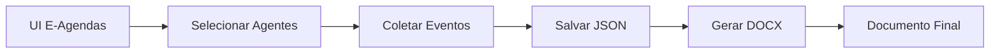

# Geração de Documentos E-Agendas

Módulo para geração de documentos DOCX com agendas de agentes públicos, coletadas do sistema E-Agendas da CGU.

## 📋 Visão Geral

O módulo `dou_utils.eagendas_document` gera documentos DOCX profissionais organizados por **agente público** (diferente do DOU que organiza por órgão). É ideal para:

- Acompanhamento de agendas de autoridades públicas
- Relatórios de transparência e accountability
- Monitoramento de compromissos institucionais
- Documentação de eventos oficiais

## 🎯 Características

- **Organização por Agente**: Cada agente público tem sua seção independente
- **Metadados Contextuais**: Órgão e cargo exibidos para cada agente
- **Agrupamento Temporal**: Eventos organizados por data dentro de cada agente
- **Formato Informal**: Preserva linguagem natural das agendas (sem regex)
- **Formatação Profissional**: Uso de cores, hierarquia e ícones para legibilidade
- **Suporte a Período**: Exibe claramente o intervalo de datas coberto

## 📦 Estrutura dos Dados

### Formato de Entrada (JSON)

```json
{
  "periodo": {
    "inicio": "YYYY-MM-DD",
    "fim": "YYYY-MM-DD"
  },
  "agentes": [
    {
      "orgao": {"id": "...", "nome": "..."},
      "cargo": {"id": "...", "nome": "..."},
      "agente": {"id": "...", "nome": "..."},
      "eventos": {
        "YYYY-MM-DD": [
          {
            "title": "Título do compromisso",
            "time": "HH:MM - HH:MM",
            "type": "Tipo de evento",
            "details": "Detalhes adicionais"
          }
        ]
      }
    }
  ]
}
```

### Campos dos Eventos

| Campo     | Descrição                          | Obrigatório |
|-----------|------------------------------------|-------------|
| `title`   | Título do compromisso              | ✅ Sim      |
| `time`    | Horário (formato livre)            | ❌ Não      |
| `type`    | Tipo de evento (ex: Reunião)       | ❌ Não      |
| `details` | Descrição adicional                | ❌ Não      |
| `date`    | Data do evento (YYYY-MM-DD)        | ✅ Sim      |

## 🚀 Uso

### 1. Importação Básica

```python
from dou_utils.eagendas_document import generate_eagendas_document

result = generate_eagendas_document(
    events_data=dados_json,
    out_path="agendas.docx",
    include_metadata=True,
    title="Agendas de Autoridades - Jan/2025"
)

print(f"Agentes: {result['agents']} | Eventos: {result['events']}")
```

### 2. A partir de arquivo JSON

```python
from dou_utils.eagendas_document import generate_eagendas_document_from_json

result = generate_eagendas_document_from_json(
    json_path="resultados/eagendas_eventos_2025-01-15_2025-01-22.json",
    out_path="agendas_semana3.docx"
)
```

### 3. Via linha de comando

```bash
# Teste com dados de exemplo
python scripts/test_eagendas_document.py

# Processar JSON real
python scripts/test_eagendas_document.py resultados/eventos.json saida.docx
```

## 📊 Estrutura do Documento Gerado

```
┌─────────────────────────────────────────┐
│  AGENDAS DE AGENTES PÚBLICOS            │
│  Período: DD/MM/YYYY a DD/MM/YYYY       │
└─────────────────────────────────────────┘

┌─ AGENTE 1 (Nome Completo) ──────────────┐
│ Órgão: ... | Cargo: ...                  │
│                                           │
│ 📅 DD/MM/YYYY                             │
│   1. Compromisso 1                        │
│      ⏰ Horário                            │
│      🏷️ Tipo                               │
│      📝 Detalhes                           │
│   2. Compromisso 2                        │
│      ...                                  │
│                                           │
│ 📅 DD/MM/YYYY                             │
│   1. Compromisso 3                        │
│      ...                                  │
└───────────────────────────────────────────┘

┌─ AGENTE 2 (Nome Completo) ──────────────┐
│ ...                                       │
└───────────────────────────────────────────┘
```

## 🎨 Personalização

### Cores Padrão

- **Título Principal**: Azul escuro (#003366)
- **Nome do Agente**: Azul médio (#0066CC)
- **Metadados**: Cinza (#666666)
- **Datas**: Cinza escuro (#333333)

### Ícones Utilizados

- 📅 Data
- ⏰ Horário
- 🏷️ Tipo de evento
- 📝 Detalhes adicionais

## 🔄 Fluxo de Coleta e Geração



1. **Coleta na UI**: Usar `app.py` para selecionar órgão → cargo → agentes
2. **Executar Coleta**: Botão "Executar" coleta eventos do período
3. **Salvar JSON**: Eventos salvos em `resultados/eagendas_eventos_*.json`
4. **Gerar Documento**: Usar módulo para converter JSON → DOCX

## 🔧 Requisitos

### Dependências Python

```txt
python-docx>=0.8.11
```

Instalação:
```bash
pip install python-docx
```

### Estrutura do Projeto

```
src/
  dou_utils/
    eagendas_document.py    # Módulo principal
    log_utils.py            # Logging

scripts/
  test_eagendas_document.py # Script de teste/demonstração

resultados/
  eagendas_eventos_*.json   # JSONs com eventos coletados
  eagendas_agentes_*.docx   # Documentos gerados
```

## 📝 Exemplo Completo

```python
#!/usr/bin/env python3
"""Gera documento de agendas para semana específica."""

from datetime import datetime, timedelta
from pathlib import Path
from dou_utils.eagendas_document import generate_eagendas_document

# 1. Definir período
hoje = datetime.now().date()
inicio = hoje - timedelta(days=7)
fim = hoje

# 2. Estruturar dados (normalmente viria do E-Agendas)
events_data = {
    "periodo": {
        "inicio": inicio.isoformat(),
        "fim": fim.isoformat()
    },
    "agentes": [
        {
            "orgao": {"id": "1", "nome": "Ministério da Economia"},
            "cargo": {"id": "10", "nome": "Ministro de Estado"},
            "agente": {"id": "100", "nome": "Fernando Haddad"},
            "eventos": {
                (inicio + timedelta(days=1)).isoformat(): [
                    {
                        "title": "Reunião com equipe econômica",
                        "time": "09:00 - 11:00",
                        "type": "Reunião Interna",
                        "details": "Planejamento fiscal do 1º semestre"
                    }
                ]
            }
        }
    ]
}

# 3. Gerar documento
result = generate_eagendas_document(
    events_data=events_data,
    out_path=Path("agendas_semana.docx"),
    include_metadata=True,
    title="Agendas da Semana - Ministério da Economia"
)

# 4. Resultado
print(f"✅ Documento gerado: {result['output']}")
print(f"📊 {result['agents']} agentes | {result['events']} eventos")
```

## 🐛 Troubleshooting

### Erro: "python-docx não está instalado"

**Solução:**
```bash
pip install python-docx
```

### Documento vazio ou sem eventos

**Causa**: Estrutura JSON incorreta ou eventos vazios

**Solução**:
1. Validar JSON com exemplo acima
2. Verificar se `agentes[].eventos` tem pelo menos 1 evento
3. Conferir formato de datas (YYYY-MM-DD)

### Formatação incorreta no documento

**Causa**: python-docx não disponível ou versão incompatível

**Solução**:
```bash
pip install --upgrade python-docx
```

## 📚 Diferenças vs. Boletim DOU

| Aspecto          | E-Agendas Document              | DOU Bulletin                    |
|------------------|----------------------------------|---------------------------------|
| Organização      | Por **agente**                   | Por **órgão**                   |
| Conteúdo         | Compromissos/eventos             | Atos normativos                 |
| Linguagem        | Informal/natural                 | Formal/jurídica                 |
| Limpeza de texto | Mínima (preserva original)       | Agressiva (regex, preâmbulos)   |
| Sumarização      | Não aplicada                     | Opcional via LLM                |
| Metadados        | Órgão + Cargo                    | Seção + Tipo de Ato             |
| Agrupamento      | Data dentro de agente            | (Órgão, Tipo Ato)               |

## 🔗 Integração com UI

Para integrar com a UI Streamlit:

1. **Coletar eventos** via `eagendas_calendar.collect_events_for_period_async()`
2. **Estruturar JSON** no formato esperado
3. **Adicionar botão** "Gerar Documento" na aba E-Agendas
4. **Chamar função** `generate_eagendas_document()`
5. **Oferecer download** do DOCX gerado

Exemplo de botão Streamlit:
```python
if st.button("📄 Gerar Documento DOCX"):
    with st.spinner("Gerando documento..."):
        result = generate_eagendas_document(
            events_data=st.session_state.eagendas_events,
            out_path=out_file,
            title=f"Agendas {inicio_str} a {fim_str}"
        )
        st.success(f"✅ {result['events']} eventos de {result['agents']} agentes")
        st.download_button("⬇️ Baixar DOCX", data=open(out_file, "rb"), file_name=out_file.name)
```

## 📄 Licença

Este módulo faz parte do projeto `dou-snaptrack` e segue a mesma licença.

## 🤝 Contribuindo

Melhorias são bem-vindas! Áreas de interesse:

- [ ] Suporte a outros formatos (Markdown, HTML)
- [ ] Filtros avançados (por tipo de evento, horário)
- [ ] Integração com calendário (iCal/ICS)
- [ ] Visualizações gráficas (timeline, heatmap)
- [ ] Comparação entre períodos

## 📞 Suporte

Para dúvidas ou problemas:
1. Verificar esta documentação
2. Executar script de teste: `python scripts/test_eagendas_document.py`
3. Consultar logs em `logs/`
4. Abrir issue no repositório
