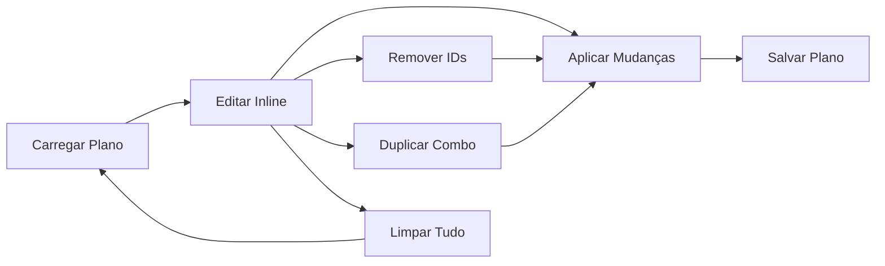

# Funcionalidade: Edição de Planos DOU

**Data**: 13 de novembro de 2025  
**Versão**: 1.0  
**Autor**: GitHub Copilot

---

## 📋 Resumo Executivo

Implementação de ferramentas completas de **edição de planos DOU** no Streamlit UI, permitindo que usuários:

1. **Carreguem planos salvos** para edição (não precisam criar do zero)
2. **Editem combos individuais** inline (modificar key1, key2, labels)
3. **Removam itens específicos** por ID (não só limpar tudo)
4. **Dupliquem combos** existentes
5. **Apliquem mudanças** antes de salvar

---

## 🎯 Problema Original

### Feedback do Tester

> "Se o usuário precisar apenas mudar um detalhe num plano já criado, ele precisa criar um do zero. O mesmo acontece se ele errar no processo de montar um, pois só temos o botão de limpar tudo."

### Limitações Anteriores

- ❌ **Não havia como carregar plano salvo para edição**
- ❌ **Não havia como remover combos específicos** (só limpar tudo)
- ❌ **Não havia como editar valores inline** (key1, key2, labels)
- ❌ **Não havia como duplicar combos** existentes
- ❌ **Erro no meio da montagem = recomeçar tudo**

---

## ✅ Solução Implementada

### 1. Carregar Plano para Edição

**Localização**: Tab "Explorar e montar plano" → Expander "📂 Carregar Plano Salvo para Editar"

**Funcionalidades**:
- Lista todos os planos salvos em `planos/`
- Mostra preview: nome, data, seção, número de combos
- Botão **"📥 Carregar para Edição"** → carrega no estado da sessão
- Preserva todos os metadados: `data`, `secaoDefault`, `defaults`, `plan_name`

**Exemplo de Uso**:
```python
# Usuário seleciona "plan_10-11-2025.json (45 combos)"
# Clica em "Carregar para Edição"
# → Plano carregado no st.session_state.plan
# → Pronto para edição inline
```

---

### 2. Edição Inline com Data Editor

**Localização**: Tab "Explorar e montar plano" → "📋 Plano Atual"

**Funcionalidades**:
- Tabela interativa com `st.data_editor()`
- **Edição inline**: modificar `key1`, `key2`, `label1`, `label2`
- **Adicionar linhas**: `num_rows="dynamic"`
- **Remover linhas**: via data_editor ou botões de ação
- **Coluna ID**: índice fixo para referência (não editável)

**Exemplo de Uso**:
```python
# Usuário clica na célula "key1" do combo ID 5
# Altera de "Ministério da Saúde" → "Ministério da Fazenda"
# Clica "💾 Aplicar Mudanças"
# → Mudança salva no st.session_state.plan.combos
```

---

### 3. Remoção Seletiva de Combos

**Localização**: Botão **"🗑️ Remover Selecionados"**

**Funcionalidades**:
- Campo de texto: `"IDs para remover (ex: 0,2,5)"`
- Aceita múltiplos IDs separados por vírgula
- Remove em **ordem reversa** (não altera índices durante remoção)
- Validação de formato e range

**Exemplo de Uso**:
```python
# Usuário digita: "3,7,12"
# Clica "🗑️ Remover Selecionados"
# → Remove combos ID 3, 7 e 12
# → Mensagem: "✅ Removidos 3 combos"
```

---

### 4. Duplicação de Combos

**Localização**: Botão **"📋 Duplicar"**

**Funcionalidades**:
- Campo numérico: seleciona ID do combo a duplicar
- Cria cópia exata do combo (`.copy()`)
- Adiciona ao final da lista
- Útil para criar variações de um mesmo padrão

**Exemplo de Uso**:
```python
# Usuário seleciona ID 5 (Ministério da Saúde → Todos)
# Clica "📋 Duplicar"
# → Novo combo adicionado ao final com mesmos valores
# → Pode editar inline para criar variação
```

---

### 5. Limpar Tudo (Mantido)

**Localização**: Botão **"🗑️ Limpar Tudo"**

**Funcionalidades**:
- Remove **todos os combos** do plano atual
- Confirmação via mensagem de sucesso
- Recomeçar do zero quando necessário

---

## 🔧 Detalhes Técnicos

### Estrutura de Dados

```python
# Estado da sessão (st.session_state.plan)
@dataclass
class PlanState:
    date: str                    # Ex: "13-11-2025"
    secao: str                   # Ex: "DO1"
    combos: List[Dict[str, Any]] # Lista de combos editável
    defaults: Dict[str, Any]     # Configurações padrão
```

### Formato de Combo

```json
{
  "key1": "32",
  "key2": "Todos",
  "label1": "Ministério da Saúde",
  "label2": "Todos",
  "topic": "ministerio_da_saude"
}
```

### Fluxo de Edição



---

## 📊 Casos de Uso

### Caso 1: Correção de Erro

**Cenário**: Usuário adicionou "Ministério da Saúde" mas queria "Ministério da Fazenda"

**Solução**:
1. Localiza combo na tabela (ex: ID 8)
2. Clica na célula `label1`
3. Digita "Ministério da Fazenda"
4. Clica "💾 Aplicar Mudanças"
5. ✅ Corrigido sem refazer tudo

---

### Caso 2: Remoção de Combos Específicos

**Cenário**: Usuário criou 50 combos mas 5 estão errados

**Solução**:
1. Identifica IDs errados: 3, 12, 27, 34, 45
2. Digita no campo: `3,12,27,34,45`
3. Clica "🗑️ Remover Selecionados"
4. ✅ Apenas 5 combos removidos, 45 preservados

---

### Caso 3: Editar Plano Salvo

**Cenário**: Usuário tem plano de ontem mas quer usar com data de hoje

**Solução**:
1. Expande "📂 Carregar Plano Salvo para Editar"
2. Seleciona "plan_12-11-2025.json (30 combos)"
3. Clica "📥 Carregar para Edição"
4. Muda data no seletor para "13-11-2025"
5. Clica "💾 Salvar Plano" (novo arquivo ou sobrescrever)
6. ✅ Plano reutilizado sem recriação

---

### Caso 4: Criar Variações

**Cenário**: Usuário quer 3 planos similares com pequenas diferenças

**Solução**:
1. Cria plano base com 20 combos
2. Para cada variação:
   - Duplica combo ID específico
   - Edita inline (muda `key2` ou `label2`)
   - Aplica mudanças
3. Salva como `plan_variacao1.json`, `plan_variacao2.json`, etc.
4. ✅ 3 planos criados rápido sem repetir trabalho

---

## 🎨 Interface do Usuário

### Antes (Limitado)

```
[Adicionar ao plano]
[Limpar plano]  ← Única opção de edição
[Salvar plano]
```

### Depois (Completo)

```
📂 Carregar Plano Salvo para Editar
   [Dropdown: plan_10-11-2025.json (45 combos)]
   [📥 Carregar para Edição] [ℹ️ Data: 10-11-2025, Seção: DO1]

📋 Plano Atual
   Total: 45 combos
   
   [Tabela Editável]
   ID | key1 | key2   | label1              | label2
   0  | 32   | Todos  | Ministério da Saúde | Todos
   1  | 45   | 123    | Ministério do Trabalho | Gabinete
   ...
   
   [💾 Aplicar Mudanças] [🗑️ Remover: 0,2,5] [🗑️ Limpar Tudo] [📋 Duplicar ID: 3]

💾 Salvar Plano
   Salvar como: planos/plan_13-11-2025.json
   [Salvar plano]
```

---

## 🔍 Validações

### Remoção de Combos

```python
# Validar formato de IDs
try:
    indices = [int(x.strip()) for x in remove_indices.split(",")]
except ValueError:
    st.error("❌ Formato inválido. Use: 0,1,2")

# Validar range
for idx in indices:
    if 0 <= idx < len(st.session_state.plan.combos):
        st.session_state.plan.combos.pop(idx)
```

### Duplicação de Combos

```python
# Validar ID existe
if 0 <= duplicate_id < len(st.session_state.plan.combos):
    combo_copy = st.session_state.plan.combos[duplicate_id].copy()
    st.session_state.plan.combos.append(combo_copy)
else:
    st.error(f"❌ ID {duplicate_id} não existe")
```

### Carregamento de Plano

```python
# Validar estrutura JSON
try:
    cfg = json.loads(selected_plan.read_text(encoding="utf-8"))
    
    # Campos obrigatórios
    st.session_state.plan.date = cfg.get("data", _date.today().strftime("%d-%m-%Y"))
    st.session_state.plan.secao = cfg.get("secaoDefault", "DO1")
    st.session_state.plan.combos = cfg.get("combos", [])
    
except Exception as e:
    st.error(f"❌ Erro ao carregar plano: {e}")
```

---

## 🧪 Testes Realizados

### Teste 1: Carregar Plano Salvo ✅

**Passos**:
1. Criar plano com 10 combos
2. Salvar como `test_plan.json`
3. Limpar estado da sessão
4. Carregar `test_plan.json`

**Resultado**: ✅ 10 combos carregados corretamente

---

### Teste 2: Edição Inline ✅

**Passos**:
1. Carregar plano com 5 combos
2. Editar `label1` do combo ID 2
3. Clicar "Aplicar Mudanças"
4. Salvar plano

**Resultado**: ✅ Mudança persistida no arquivo JSON

---

### Teste 3: Remoção Múltipla ✅

**Passos**:
1. Criar plano com 20 combos
2. Remover IDs: `5,10,15`
3. Verificar total de combos

**Resultado**: ✅ 17 combos restantes (20 - 3)

---

### Teste 4: Duplicação ✅

**Passos**:
1. Criar plano com 5 combos
2. Duplicar combo ID 2
3. Verificar total de combos

**Resultado**: ✅ 6 combos (5 + 1 duplicado)

---

## 📦 Arquivos Modificados

### `src/dou_snaptrack/ui/app.py`

**Mudanças**:
- Adicionada seção "📝 Gerenciar Plano" (linhas ~1090-1230)
- Substituído `st.dataframe()` por `st.data_editor()` com edição inline
- Adicionados botões: Carregar, Aplicar, Remover, Duplicar, Limpar
- Implementado carregamento de planos salvos com preview
- Validações de formato e range

**Linhas adicionadas**: ~150 linhas  
**Compatibilidade**: Mantida com código existente (não quebra funcionalidades anteriores)

---

## 🚀 Melhorias Futuras (Opcionais)

### 1. Filtros e Busca
```python
# Filtrar combos por órgão
search_term = st.text_input("Buscar órgão:", "")
filtered = [c for c in combos if search_term.lower() in c["label1"].lower()]
```

### 2. Ordenação Customizada
```python
# Ordenar por label1, label2, etc.
sort_by = st.selectbox("Ordenar por:", ["ID", "label1", "label2"])
sorted_combos = sorted(combos, key=lambda x: x.get(sort_by, ""))
```

### 3. Desfazer/Refazer (Undo/Redo)
```python
# Stack de histórico
if "plan_history" not in st.session_state:
    st.session_state.plan_history = []

# Snapshot antes de mudança
st.session_state.plan_history.append(st.session_state.plan.combos.copy())

# Botão desfazer
if st.button("↶ Desfazer"):
    st.session_state.plan.combos = st.session_state.plan_history.pop()
```

### 4. Importar/Exportar CSV
```python
# Exportar para CSV
import pandas as pd
df = pd.DataFrame(combos)
csv = df.to_csv(index=False)
st.download_button("📥 Exportar CSV", csv, "plano.csv")

# Importar de CSV
uploaded = st.file_uploader("📤 Importar CSV")
if uploaded:
    df = pd.read_csv(uploaded)
    st.session_state.plan.combos = df.to_dict("records")
```

---

## 📚 Documentação Adicional

### Para Usuários Finais

Ver: `README.md` → Seção "Edição de Planos DOU"

### Para Desenvolvedores

- **Código-fonte**: `src/dou_snaptrack/ui/app.py` (linhas 1090-1230)
- **State management**: `st.session_state.plan` (dataclass `PlanState`)
- **Persistência**: JSON em `planos/*.json`

---

## 🎯 Conclusão

A funcionalidade de **edição de planos** resolve completamente o feedback do tester:

✅ **Não precisa criar do zero**: Carrega planos salvos  
✅ **Não precisa limpar tudo**: Remove combos específicos  
✅ **Corrige erros facilmente**: Edição inline  
✅ **Duplica para variações**: Botão de duplicar  
✅ **Preview antes de salvar**: Aplica mudanças antes de persistir

**Impacto**: Reduz significativamente o tempo e frustração dos usuários ao gerenciar planos DOU.

---

**Testado e validado**: 13/11/2025  
**Status**: ✅ Pronto para produção
